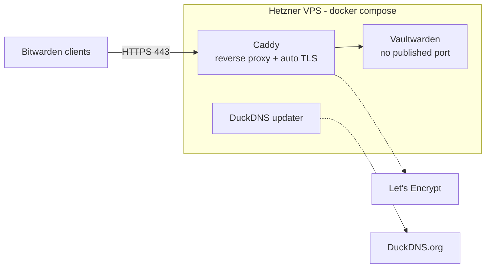

# Self-Hosted Vaultwarden

Self-hosted Bitwarden-compatible password manager, deployed on an existing
Hetzner VPS alongside an unrelated production process that could not be
disturbed — plus a set of local-only Python tools for auditing and
migrating a 500-entry password vault that had never been reviewed.

## Why

Have I Been Pwned showed several of my email addresses across dozens of
aggregated breach/stealer-log dumps. Digging into *why*: one password,
created back in 2013, turned out to be reused across 200+ sites — including
a brokerage account, payment systems, and a crypto exchange. The password
itself was a word typed in the wrong keyboard layout (Cyrillic word, typed
on a US layout) — a pattern with ready-made hashcat rules and `kwprocessor`
support, so its real-world entropy was close to zero despite passing any
naive length/character-set check.

That's the actual motivation for all of this: move to unique, generated
passwords per service, stored in something that isn't a cloud provider's
built-in password manager.

## Architecture



Vaultwarden has no `ports:` entry in the compose file — it's reachable only
from other containers on the internal Docker network. Caddy is the only
service exposed to the host, and it's the only thing the internet ever
talks to.

The VPS also runs an unrelated production process (a `screen` session with
4+ months of uptime) outside this stack — not part of the diagram above
since it's untouched by any of this, but it's the reason every step below
was planned read-only-first. See [Constraint that shaped every
step](#constraint-that-shaped-every-step).

## Stack

- **[Vaultwarden](https://github.com/dani-garcia/vaultwarden)** — Rust
  reimplementation of the Bitwarden server API. Not a fork in the git
  sense; a separate, independently audited project that speaks the same
  protocol, so the official Bitwarden clients (iOS app, browser extension)
  work against it unmodified.
- **Caddy** — reverse proxy, automatic Let's Encrypt cert via `tls-alpn-01`.
- **DuckDNS** — free updating subdomain (no domain was already owned).
- **Docker + Docker Compose**, installed from Docker's official apt
  repository, not the distro-packaged version or snap.

## Constraint that shaped every step

The VPS already ran an unrelated process in a `screen` session with 4+
months of uptime — a data-collection job that could not be interrupted
under any circumstances. Every step below was planned and executed as
read-only-first:

1. **Recon before touching anything**: enumerated running `screen`
   sessions and Docker containers, confirmed nothing about to be installed
   would conflict, checked port 80/443 were actually free before binding
   Caddy to them.
2. **Docker install**: official repo, no interaction with existing
   processes, no reboot (checked in advance that it wouldn't require one).
3. **Deploy**: three containers, `docker compose up -d`, verified with
   `docker compose ps` / `docker compose logs` that the pre-existing
   `screen` sessions were still running, untouched, throughout.

## Security decisions

- **KDF: Argon2id**, not PBKDF2 — memory-hard, materially more expensive
  to attack on GPU/ASIC hardware than an iteration-count-only KDF.
- **`SIGNUPS_ALLOWED=false`** the moment the one real account existed —
  closes public registration on the instance.
- **Secrets in `.env`, `chmod 600`, never in the compose file itself** —
  admin token and DuckDNS token are not committed, not passed as inline
  environment values in `compose.yaml`.
- **Master password via [Diceware](https://www.eff.org/dice)** (Reinhold,
  1995) — four words picked with actual dice rolls against the EFF long
  wordlist (7776 words, ~12.9 bits of entropy per word), not typed from
  memory. A physical backup exists, offline, separate from any device —
  zero-knowledge encryption means there is no server-side recovery if it's
  lost.
- **No keyboard-layout transliteration** for the master password either —
  same weakness as the leaked password that started this project.
- **Public HTTPS + Caddy, not a mesh VPN.** Tailscale was the first choice
  (zero public exposure), dropped once it was clear the vault needed to be
  reachable from a work machine where installing a VPN client wasn't an
  option. Traded network-level isolation for standard hardening instead
  (long random admin token, `.env` permissions, Caddy as the only exposed
  surface).

## Migrating the actual vault

- Exported from Google Password Manager (CSV) and iOS Keychain, imported
  into Bitwarden: ~500 login entries, ~485 of them external (not
  localhost/LAN).
- Grouped by reused password instead of reviewing 500 entries one at a
  time — 42 reuse groups surfaced, the worst one shared across 200+ sites
  including financial services.
- Rotated by priority: CRITICAL (email, banks, payment systems, crypto
  exchanges, billed cloud infra) → HIGH (social media, work/school
  systems) → MEDIUM/LOW (forums, non-monetized game accounts). Primary
  email, GitHub, primary exchange, and the payment system it shared a
  password with were closed out in the first session.
- See [`scripts/`](#vault-audit-tooling) below for the actual tools used
  for this — they're generic enough to reuse on any Bitwarden-compatible
  export.

## Devlog

Things that broke, in the order they were found:

### `docker compose up -d` recreated every container, not just the edited one

Changed one environment variable (`SIGNUPS_ALLOWED`) in `compose.yaml`,
expected only the affected service to restart. Compose recreated all
three containers instead — it diffs the whole project's config, not
per-service. No data lost (everything lives in volumes, not container
filesystems), but worth assuming up front if other sensitive processes
share the host: a `compose up -d` is not guaranteed to be scoped to what
you changed.

### Bitwarden sometimes saved a duplicate item instead of updating the import

Changing a password directly on a site (not via the extension's
"generate & fill") occasionally saved as a **new, oddly-named item**
instead of updating the imported one — caused by the current page's URL
(e.g. a password-change confirmation screen) not matching the URI stored
on the original entry. Left some accounts with 2-3 cards and different
passwords until sorted out by hand. Same caution applies to services that
run more than one domain for the same account (e.g. a `.com` / `.eu` pair)
— don't assume they're the same login without checking.

### Not every password change shows up in `passwordHistory`

One entry (a brokerage account) had its `revisionDate` update but left no
new entry in `passwordHistory` — likely a manual password entry rather
than the generator, or an edit to a different field entirely.
`passwordHistory` is useful for audit but not airtight; verifying
high-value entries by eye is still necessary.

### `revisionDate` is useless for "what changed" right after a bulk import

The first `bw sync` after migrating ~500 old entries into the new
self-hosted vault stamped `revisionDate` identically across the entire
vault within about two minutes. A same-day filter on that field returns
the whole vault, not real edits. Fixed by reading `passwordHistory`
instead (only grows on an actual password overwrite) for retroactive
analysis, and by snapshotting `id`/`name`/`uris`/`revisionDate` — never
the password — at known points in time for forward-looking diffs.

### Diffing exports by "first URI in the list" invented phantom new entries

Bitwarden doesn't guarantee URI order stays stable across exports. An item
with multiple saved URIs can show a different one first on a later export,
which makes it look like a brand-new entry if you're comparing on that
text instead of on the item's stable internal `id`. Switched to id-based
diffing and the false positives disappeared.

### Changing the Google account password logged out every linked session

Expected but not planned for: rotating the Google password invalidated
active sessions on linked services (Gmail, YouTube, etc.) on other
devices — correct security behavior, briefly confusing in the moment.

### `needrestart` false alarm after installing Docker

Post-install, `needrestart` flagged several unrelated system daemons
(`dbus`, `systemd-logind`, ...) as pending a restart. Standard Ubuntu
`apt` behavior, unrelated to Docker or the pre-existing `screen` sessions
— none of those daemons needed touching, and nothing on the host required
a reboot.

## Lessons

1. **Formal password strength isn't real strength.** A password that fits
   a known pattern (word + number, keyboard-layout transliteration)
   breaks far faster than a naive entropy estimate suggests — dedicated
   tooling exists for exactly these patterns.
2. **Zero-knowledge cuts both ways.** It protects against a server
   compromise and removes any path to recovering a lost master password —
   a physical backup isn't optional.
3. **Bulk operations (import, sync) break naive time-based auditing.**
   Snapshot with a stable id ahead of time if you'll want to track
   progress later.
4. **Prioritize by reuse group, not by entry count.** Out of ~500
   passwords, the real work was a few dozen unique values.

---

## Vault audit tooling

Local-only Python scripts used for the migration above — read a Bitwarden
JSON export, find reused passwords, prioritize rotation, and track real
changes over time without getting fooled by the sync noise described in
the devlog. No dependencies, no API keys, nothing leaves the machine.

| Script | Purpose |
|---|---|
| `scripts/group_reused_passwords.py` | How many entries reuse the same password, grouped and ranked by size. |
| `scripts/priority_report.py` | Two-phase pipeline — `extract` pulls reuse groups down to bare site names (no passwords), `report` turns a categorized version of that list into a markdown priority report. A group is bumped to top priority the moment *any* site in it is CRITICAL, regardless of group size. |
| `scripts/build_categories_example.py` | Starter rule table for the categorization step. Meant to be edited with your own domains, not used as-is. |
| `scripts/build_snapshot.py` | Strips a full export down to a password-free `{id, name, uris, revisionDate}` snapshot. |
| `scripts/diff_snapshots.py` | Compares two snapshots by stable `id` — real new/removed/edited entries, immune to URI reordering. |
| `scripts/track_recent_changes.py` | What changed in the last N hours, classified as a new item, an actual password rotation (`passwordHistory`), or an unrelated field edit. |

```bash
bw sync
bw export --format json --output vault_export.json

python3 scripts/group_reused_passwords.py vault_export.json

python3 scripts/priority_report.py extract vault_export.json --output extracted.json
python3 scripts/build_categories_example.py extracted.json --output categories.json
python3 scripts/priority_report.py report --extracted extracted.json --categories categories.json

python3 scripts/build_snapshot.py vault_export.json --output vault_snapshot_$(date +%Y%m%d).json
python3 scripts/track_recent_changes.py vault_export.json --hours 3

shred -u vault_export.json          # Linux/macOS
Remove-Item vault_export.json -Force # Windows PowerShell
```

A synthetic demo export lives at `examples/sample_vault_export.json` — every
command above runs against it with no real vault required:

```bash
python3 scripts/group_reused_passwords.py examples/sample_vault_export.json
```

### Why local-only

- **No API key, no network calls.** Categorization is a plain rule table
  you edit yourself — nothing to authenticate against.
- **Passwords never get written or printed.** Grouping uses a SHA-256
  hash of the password as an in-memory dict key; the plaintext value never
  leaves the variable it's read into, and console output shows only a
  masked preview (`Ol****3!`).
- **Snapshots are safe to keep.** `build_snapshot.py`'s output schema has
  no password field at all — fine to commit for a rotation history.
- **`vault_export.json`, the one file with real secrets, is never touched
  after use.** Every script that reads it reminds you to shred it.

## Requirements

Docker + Docker Compose for the infra; Python 3.10+ (standard library
only) for the scripts. Separately, the
[Bitwarden CLI](https://bitwarden.com/help/cli/) (`bw`) to produce the
`vault_export.json` the scripts read.

## License

MIT — see [LICENSE](LICENSE).
